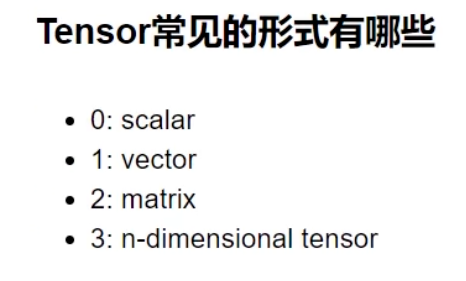

[Get Started](https://pytorch.org/get-started/locally/?_gl=1*al9lz4*_up*MQ..*_ga*MTQ3MDgxMTUxOS4xNzY5NTk5ODE5*_ga_469Y0W5V62*czE3Njk1OTk4MTgkbzEkZzAkdDE3Njk1OTk4MTgkajYwJGwwJGgw)

空矩阵

```
torch.empty(5,3)
```

随机值矩阵

```
torch.rand(5.3)
```

全零矩阵

```
torch.zeros(5,3,dtype=torch.long)
```

创建一个和传入矩阵长宽相同的矩阵

```
import torch
x = torch.tensor([5,5,3])
x= x.new_ones(5,3,dtype=torch.double)
x=torch.randn_like(x, dtype=torch.float)
print(x)
```


打印矩阵大小

```
x.size()
```


将4x4矩阵变为1x16或者2x8的矩阵

```
x = torch.randn(4,4)
y = x.view(16)
z = x.view(-1,8)
print(x.size(), y.size(), z.size())
```


torch转numpy

```
a = torch.ones(5)
b = a.numpy()
print(b)
```

numpy转torch

```
import numpy as np
a = np.ones(5)
b = torch.from_numpy(a)
pri
```


训练一个nn实现线性回归，并且保存权重参数到硬盘

```python
import torch;
import torch.nn as nn
import numpy as np;

class LinearRegression(nn.Module):
    def __init__(self,input_dim,output_dim):
        super(LinearRegression,self).__init__()
        self.linear = nn.Linear(input_dim,output_dim)
    def forward(self, x):
        out = self.linear(x)
        return out

x_values = [i for i in range(11)]
x_train = np.array(x_values,dtype=np.float32)
x_train = x_train.reshape(-1,1)
print(x_train.shape)

y_values = [2*i +1 for i in x_values]
y_train = np.array(y_values,dtype=np.float32)
y_train = y_train.reshape(-1,1)
print(y_train.shape)

input_dim = 1
output_dim = 1

model = LinearRegression(input_dim,output_dim)

epochs = 1000
learning_rate = 0.01
optimizer = torch.optim.SGD(model.parameters(),lr=learning_rate)
criterion = nn.MSELoss()

for epoch in range(epochs):
    epoch += 1
    inputs = torch.from_numpy(x_train)
    labels = torch.from_numpy(y_train)

    optimizer.zero_grad()

    outputs = model(inputs)

    loss = criterion(outputs,labels)
    loss.backward()

    optimizer.step()
    if epoch % 50 == 0:
        print('epoch {}: loss {}'.format(epoch, loss.item()))

b = x_train + 5
predicted = model(torch.from_numpy(b).requires_grad_()).data.numpy()
print(predicted)

print(b)
print(y_train)

torch.save(model.state_dict(),'model.pk1')
torch.load('model.pk1')
```





pytorch的hub模块，直接调用别人的模型

[PyTorch HubFor Researchers – PyTorch](https://pytorch.org/hub/)

```python
import torch
model = torch.hub.load('pytorch/vision:v0.10.0', 'resnet18', pretrained=True)
# or any of these variants
# model = torch.hub.load('pytorch/vision:v0.10.0', 'resnet34', pretrained=True)
# model = torch.hub.load('pytorch/vision:v0.10.0', 'resnet50', pretrained=True)
# model = torch.hub.load('pytorch/vision:v0.10.0', 'resnet101', pretrained=True)
# model = torch.hub.load('pytorch/vision:v0.10.0', 'resnet152', pretrained=True)
model.eval()
```

